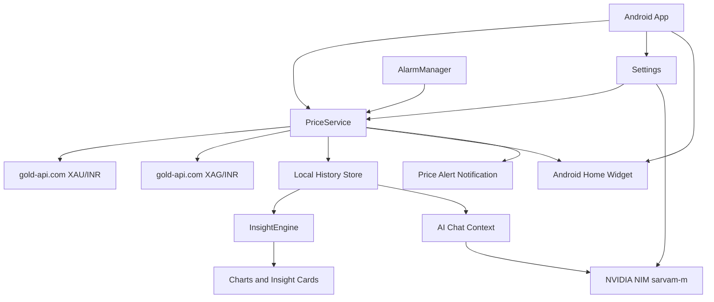

# Aura 10/10


 Android app for indicative Chennai gold and silver rates.(demo just base try)

## Tech Stack

| Layer | Choice |
| --- | --- |
| App | Native Android |
| Language | Java 17 |
| UI | Programmatic Android Views |
| Widget | Android AppWidget RemoteViews |
| Storage | Local SharedPreferences JSON history |
| Background refresh | AlarmManager hourly refresh |
| Price API | gold-api.com by default |
| AI | NVIDIA NIM chat completions |
| Default AI model | sarvam-m |

## What The App Does

- Shows indicative Chennai gold and silver rates in a clean card UI.
- Displays gold 24K, 22K, 18K, 22K pavan, silver per gram, 8 gram, and ounce values.
- Saves price history locally on the phone.
- Shows monthly and yearly average, peak, and low values from stored data.
- Adds a home-screen widget with clear per gram price.
- Lets the widget switch between gold and silver by tapping the price.
- Supports widget refresh and Buy Now redirect to Aura Gold.
- Includes English and Tamil insight text.
- Includes AI chat backed by NVIDIA when an API key is available.
- Falls back to local deterministic answers if AI is unavailable.
- Lets users override API URLs, NVIDIA endpoint/model, update interval, alert threshold, and Buy Now link from Settings.

## Architecture



## Price Data

The default endpoints are:

```text
https://api.gold-api.com/price/XAU/INR
https://api.gold-api.com/price/XAG/INR
```

The app converts troy ounce prices to grams using:

```text
1 troy ounce = 31.1034768 grams
```

The Chennai label is shown as indicative because the app uses live metal spot pricing in INR, not a shop-specific jewellery retail quote.

## NVIDIA API Key

For the local APK build, place the NVIDIA key in:

```text
myAPINvidia.txt
```

The Gradle build generates an obfuscated Java class from that file. The raw file is ignored by Git.

Important: this is obfuscation, not real security. It hides the key from casual source browsing, but a determined person can still recover a key from a shared APK. For production, use a backend proxy such as Cloudflare Workers, Firebase Functions, or any trusted server.

## Build

Requirements:

- Android SDK installed
- Java installed
- Gradle available from local cache or wrapper

Build debug APK:

```powershell
.\gradlew.bat assembleDebug
```

APK output:

```text
app/build/outputs/apk/debug/app-debug.apk
```

## Install

Copy or share the debug APK and install it on an Android phone. The phone may ask to allow installs from the sharing app.

For a Play Store style release, create a signing keystore and build a release APK or AAB.
